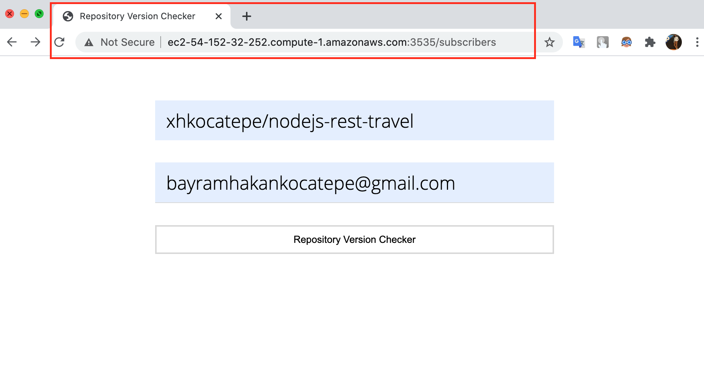
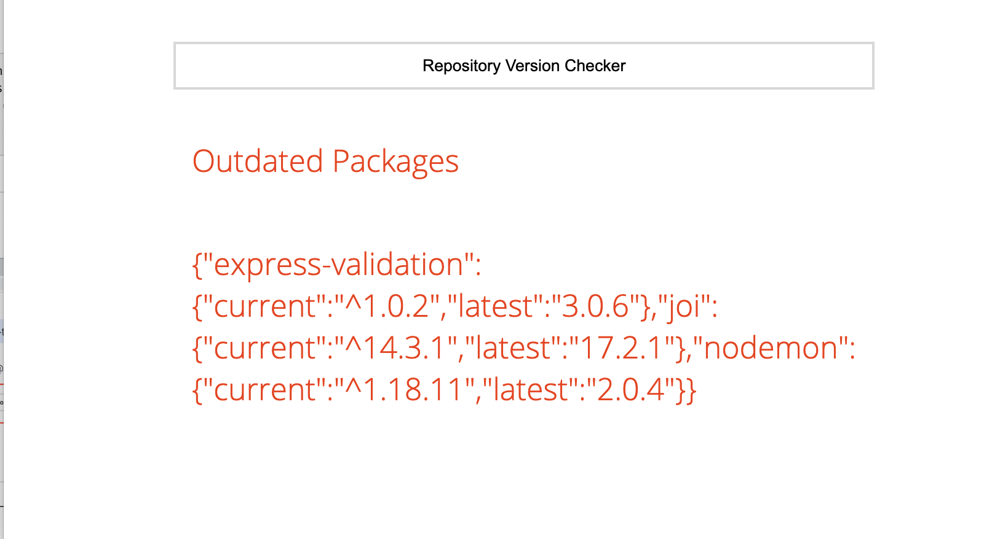

# repository-version-checker
Repository Version Checker

npm install

npm run start

After run,

Open the web site

http://localhost:1338/subscribers 

You can enter two fields

Then show outdated packages. Woow!

